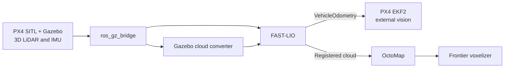

# PX4 SITL FAST-LIO Mapping

[](https://docs.ros.org/en/humble/)
[](https://docs.px4.io/main/en/simulation/)
[](LICENSE)

Reproducible 3D LiDAR-inertial mapping for PX4 SITL and Gazebo. The stack
converts simulated LiDAR and IMU data for FAST-LIO, builds a probabilistic 3D
occupancy map with OctoMap, can experimentally extract frontier candidates,
and publishes FAST-LIO odometry to PX4 as external vision.

> [!IMPORTANT]
> This repository is a **public preview**. The ROS 2 mapping workspace is
> pinned, build-tested, and documented. The reference PX4 x500 LiDAR model and
> world are still being separated from a development workspace and are not yet
> included. Until they are published, bring a Gazebo model that provides the
> topics listed in [Simulator interface](#simulator-interface).
>
> Frontier extraction is experimental and remains under active development. It
> is included for testing and visualization, not as a stable planning API.

## What it provides

- Gazebo `PointCloudPacked`, IMU, and simulation-clock bridges to ROS 2
- Conversion of organized Gazebo point clouds into FAST-LIO input
- Preservation of no-return rays for correct OctoMap free-space clearing
- FAST-LIO LiDAR-inertial odometry and registered point-cloud mapping
- ENU/FLU to NED/FRD odometry conversion for PX4 external vision
- Incremental OctoMap occupancy mapping
- Experimental frontier voxelization and RViz visualization
- Commit-pinned source import for reproducible builds

## Status

| Capability | Status |
| --- | --- |
| Pinned ROS 2 workspace import | Ready |
| Clean ROS 2 Humble build | Ready |
| Gazebo-to-ROS sensor bridge script | Ready |
| FAST-LIO, PX4 odometry, and OctoMap launch | Ready |
| Frontier detection and visualization | In development |
| Reference PX4 x500 LiDAR model and world | In progress |
| Clean-checkout end-to-end SITL release test | Pending model publication |

## Architecture



See [docs/architecture.md](docs/architecture.md) for component boundaries and
data-flow details.

## Requirements

The reference environment is:

- Ubuntu 22.04 LTS
- ROS 2 Humble
- Gazebo Harmonic through `ros_gz`
- PX4 SITL with uXRCE-DDS
- CMake 3.22 or newer and a C++17 compiler
- At least 8 GB RAM; 16 GB is recommended for parallel builds and RViz

Only Ubuntu 22.04 with ROS 2 Humble is currently supported. Native Linux with
a GPU is recommended; virtual machines may not provide usable Gazebo graphics
performance.

## Installation

### 1. Install ROS and workspace tools

Install [ROS 2 Humble](https://docs.ros.org/en/humble/Installation/Ubuntu-Install-Debs.html),
then install the build and bridge tools:

```bash
sudo apt update
sudo apt install -y \
  build-essential cmake git \
  python3-colcon-common-extensions python3-rosdep python3-vcstool \
  ros-humble-ros-gzharmonic
```

Initialize `rosdep` once on a new ROS installation:

```bash
sudo rosdep init
rosdep update
```

If `rosdep` reports that it is already initialized, continue to the next step.

### 2. Install Livox-SDK2

FAST-LIO uses the Livox custom message definitions, so the driver package is
built even when the simulated sensor publishes `PointCloud2`.

```bash
git clone https://github.com/Livox-SDK/Livox-SDK2.git
cmake -S Livox-SDK2 -B Livox-SDK2/build -DCMAKE_BUILD_TYPE=Release
cmake --build Livox-SDK2/build --parallel
sudo cmake --install Livox-SDK2/build
sudo ldconfig
```

### 3. Install the PX4 ROS 2 agent

Build the Micro XRCE-DDS Agent version used by ROS 2 Humble and current PX4
releases:

```bash
git clone -b 2.4.2 https://github.com/eProsima/Micro-XRCE-DDS-Agent.git
cmake -S Micro-XRCE-DDS-Agent -B Micro-XRCE-DDS-Agent/build \
  -DCMAKE_BUILD_TYPE=Release
cmake --build Micro-XRCE-DDS-Agent/build --parallel
sudo cmake --install Micro-XRCE-DDS-Agent/build
sudo ldconfig
```

Install the PX4 SITL toolchain using the
[official Ubuntu setup guide](https://docs.px4.io/main/en/dev_setup/dev_env_linux_ubuntu).
The reference PX4 fork will be added to the pinned manifest after its model
changes are isolated and validated.

### 4. Clone and import pinned sources

```bash
git clone https://github.com/rlaglo/px4-fastlio-mapping.git
cd px4-fastlio-mapping
./scripts/setup_workspace.sh
```

The setup script imports every source revision from
[`dependencies.repos`](dependencies.repos), including nested submodules, and
installs package dependencies with `rosdep`.

### 5. Build

```bash
./scripts/build_workspace.sh
```

For a new terminal, source the workspace before using ROS commands directly:

```bash
source /opt/ros/humble/setup.bash
source install/setup.bash
```

## Running the mapping stack

The following commands use separate terminals. Run them from the repository
root unless noted otherwise.

### Terminal 1: start the PX4 ROS 2 agent

PX4 SITL automatically starts its uXRCE-DDS client on UDP port `8888`.

```bash
MicroXRCEAgent udp4 -p 8888
```

For ROS 2 Humble, use a Micro XRCE-DDS Agent version compatible with your PX4
release; PX4's current compatibility table specifies the 2.4.2 line for
Humble. See the [PX4 uXRCE-DDS guide](https://docs.px4.io/main/en/middleware/uxrce_dds)
for installation and version details.

### Terminal 2: start PX4 SITL and Gazebo

Start a PX4 Gazebo vehicle with a 3D LiDAR and IMU. The current public preview
does not yet ship the reference model, so confirm that Gazebo publishes the
required sensor topics:

```bash
gz topic -l | grep -E '(^/lidar/points$|^/imu/data$|^/clock$)'
```

The forthcoming reference command will be documented here when the x500 LiDAR
model fork is published. A stock `gz_x500` does not provide the required 3D
LiDAR topic.

When Gazebo `/clock` is the time source, disable PX4 uXRCE-DDS time
synchronization in the PX4 shell:

```text
param set UXRCE_DDS_SYNCT 0
```

### Terminal 3: bridge Gazebo sensors to ROS 2

```bash
./scripts/run_gazebo_bridge.sh
```

This creates one-way Gazebo-to-ROS bridges for `/lidar/points`, `/imu/data`,
and `/clock`.

### Terminal 4: launch mapping

```bash
./scripts/run_mapping.sh
```

This single launch starts the Gazebo point-cloud converter, FAST-LIO,
`px4bridge`, OctoMap, the frontier voxelizer, and RViz. To run without RViz:

```bash
./scripts/run_mapping.sh false
```

### Verify the pipeline

```bash
./scripts/check_topics.sh
```

A healthy pipeline reports every expected topic as `OK`. Inspect message rates
when diagnosing sensor problems:

```bash
ros2 topic hz /lidar/points
ros2 topic hz /imu/data
ros2 topic hz /Odometry
```

## Simulator interface

Until the reference simulator assets are released, a compatible Gazebo model
must provide:

| Gazebo topic | Gazebo message type | ROS 2 type | Expected rate |
| --- | --- | --- | --- |
| `/lidar/points` | `gz.msgs.PointCloudPacked` | `sensor_msgs/msg/PointCloud2` | 10 Hz |
| `/imu/data` | `gz.msgs.IMU` | `sensor_msgs/msg/Imu` | 100 Hz or higher |
| `/clock` | `gz.msgs.Clock` | `rosgraph_msgs/msg/Clock` | Simulator controlled |

The default LiDAR profile is 16 channels, 360-degree horizontal coverage,
-15 to +15 degrees vertical coverage, and a 10 m maximum range. If the sensor
differs, update `simulator`, `preprocess`, and `mapping` parameters in the
FAST-LIO `config/velodyne.yaml` file.

## Important ROS topics

| Topic | Type | Producer | Consumer |
| --- | --- | --- | --- |
| `/lidar/points` | `sensor_msgs/msg/PointCloud2` | `ros_gz_bridge` | Gazebo cloud converter |
| `/lio/raw_points` | `sensor_msgs/msg/PointCloud2` | Cloud converter | FAST-LIO |
| `/imu/data` | `sensor_msgs/msg/Imu` | `ros_gz_bridge` | FAST-LIO |
| `/Odometry` | `nav_msgs/msg/Odometry` | FAST-LIO | `px4bridge` |
| `/cloud_registered_body` | `sensor_msgs/msg/PointCloud2` | FAST-LIO | OctoMap |
| `/fmu/in/vehicle_visual_odometry` | `px4_msgs/msg/VehicleOdometry` | `px4bridge` | PX4 |
| `/octomap_full` | `octomap_msgs/msg/Octomap` | OctoMap server | Frontier voxelizer |
| `/frontier/points` | `geometry_msgs/msg/PoseArray` | Experimental frontier voxelizer | Planner or visualizer |

The `/frontier/*` interface is not stable yet and may change without backward
compatibility until frontier development reaches a validated release.

Publishing `/fmu/in/vehicle_visual_odometry` does not by itself make PX4 fuse
the estimate. Configure EKF2 external-vision fusion for the PX4 release in use,
and verify frames and timestamps before flight-controller tuning.

## Saving a map

Save the current occupancy map as an OctoMap binary tree:

```bash
ros2 run octomap_server octomap_saver_node --ros-args \
  -p octomap_path:="${PWD}/map.bt"
```

Generated `.bt`, `.ot`, `.pcd`, and rosbag files are intentionally ignored by
Git.

## Source policy and pinned components

Modified third-party components live in forks with upstream history and
licenses preserved. Unmodified source is pinned directly to an upstream
commit. `vcs import` checks out the exact revisions below rather than moving
branches.

| Component | Source policy | Purpose |
| --- | --- | --- |
| [FAST_LIO_ROS2](https://github.com/rlaglo/FAST_LIO_ROS2) | Modified fork | Gazebo conversion and LiDAR-inertial odometry |
| [octomap_mapping](https://github.com/rlaglo/octomap_mapping) | Modified fork | Occupancy mapping and experimental frontier voxelization |
| [livox_ros_driver2](https://github.com/rlaglo/livox_ros_driver2) | Modified fork | Native ROS 2 Humble package and Livox messages |
| [px4bridge](https://github.com/rlaglo/px4bridge) | Project repository | ROS odometry to PX4 `VehicleOdometry` |
| [px4_msgs](https://github.com/PX4/px4_msgs) | Pinned upstream | PX4 ROS 2 message definitions |

The exact commit hashes are the source of truth in
[`dependencies.repos`](dependencies.repos).

## Repository layout

```text
px4-fastlio-mapping/
├── dependencies.repos       # Pinned source manifest
├── docs/                    # Architecture and design notes
├── scripts/                 # Setup, build, launch, and checks
├── src/                     # Generated by vcstool; not committed
├── build/ install/ log/     # Generated by colcon; not committed
├── LICENSE
└── README.md
```

## Troubleshooting

**No `/lidar/points` or `/imu/data` topic**

Check Gazebo Transport with `gz topic -l`, then keep the bridge process running.
Topic names are exact and case-sensitive.

**FAST-LIO waits for data**

Confirm `/clock`, LiDAR, and IMU are active and use simulation time. Check that
the cloud fields can be inspected with `ros2 topic echo /lidar/points --once`.

**Livox SDK not found during CMake configuration**

Install Livox-SDK2 to `/usr/local`, run `sudo ldconfig`, and rebuild.

**PX4 does not receive external vision**

Verify the Micro XRCE-DDS Agent is connected, the `px4_msgs` revision matches
the PX4 release, and `/fmu/in/vehicle_visual_odometry` has subscribers.

**Gazebo runs slowly**

Disable RViz with `./scripts/run_mapping.sh false`, reduce the sensor update
rate, or lower the LiDAR resolution before changing FAST-LIO parameters.

## Roadmap

- Publish clean PX4-Autopilot and PX4 Gazebo model forks
- Add the reference x500 3D LiDAR model and mapping world
- Add a one-command end-to-end SITL launcher
- Validate and stabilize frontier detection, filtering, and topic interfaces
- Validate installation from a fresh Ubuntu 22.04 checkout
- Add CI for source import, formatting, and ROS package builds
- Tag the first reproducible release

## Contributing

Bug reports and focused pull requests are welcome through
[GitHub Issues](https://github.com/rlaglo/px4-fastlio-mapping/issues). Include
your Ubuntu, ROS, PX4, and Gazebo versions; the command used; relevant logs; and
the output of `./scripts/check_topics.sh` when applicable.

## License and acknowledgements

Integration files in this repository are licensed under the
[BSD 3-Clause License](LICENSE). Imported projects retain their own licenses.

This project builds on [PX4](https://px4.io/),
[FAST-LIO](https://github.com/hku-mars/FAST_LIO),
[OctoMap](https://octomap.github.io/),
[Livox-SDK2](https://github.com/Livox-SDK/Livox-SDK2), and
[ros_gz](https://github.com/gazebosim/ros_gz).

codex was used while making readme
