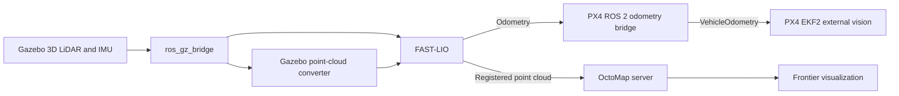

# Architecture

## Data flow

## Repository boundaries

The integration repository owns setup, launch orchestration, pinned dependency
metadata, and user documentation. Algorithm and simulator changes remain in
their respective forks so that upstream history, licensing, and future rebases
stay clear.

| Component | Planned source |
| --- | --- |
| Workspace orchestration and documentation | This repository |
| LiDAR-inertial odometry and Gazebo conversion | FAST-LIO ROS 2 fork |
| Odometry frame and message conversion | `px4bridge` |
| Occupancy mapping and frontier visualization | OctoMap mapping fork |
| Vehicle message definitions | Pinned upstream `px4_msgs` revision |
| Vehicle model and world | PX4 Gazebo models fork |
| Autopilot configuration | PX4-Autopilot mapping branch |

## Release boundary

The initial release targets a single x500 3D LiDAR demonstration. Competition
vehicles, unrelated worlds, planners, and multi-vehicle behavior are outside
the initial release scope.
